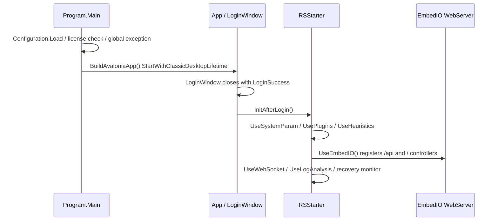

# 02：后端架构

## Solution / Project

Solution 数量：**1**；Project 数量：**12**。

| Project | TargetFramework | ProjectReference | 主要 PackageReference |
| --- | --- | --- | --- |
| HZ.Common | net8.0 |  | Newtonsoft.Json 13.0.4 |
| SimpleCore | netstandard2.0 | ../SimpleTools/SimpleTools.csproj | Newtonsoft.Json 13.0.4 Jint 3.1.6 morelinq 4.3.0 System.Reflection.Metadata 8.0.0 System.Collections.Immutable 8.0.0 System.Drawing.Common 8.0.0 System.Threading.Tasks.Extensions 4.5.4 |
| SimpleTools | netstandard2.0 |  |  |
| HZ.Interfaces | net8.0 | ../HZ.Common/HZ.Common.csproj ../HZ.Model/HZ.Model.csproj ../HZ.Tools/HZ.DbHelper/HZ.DbHelper.csproj ../HZ.Tools/HZ.Redis/HZ.Redis.csproj | Autofac 8.2.0 SqlSugarCore 5.1.4.214 |
| HZ.Model | net8.0 | ../HZ.Cores/SimpleCore/SimpleCore.csproj | SqlSugarCore 5.1.4.214 System.ComponentModel.Annotations 5.0.0 |
| HZ.RSSComposer | net8.0 | ../HZ.Common/HZ.Common.csproj ../HZ.Interfaces/HZ.Interfaces.csproj ../HZ.Model/HZ.Model.csproj ../HZ.Tools/HZ.LanguageTrans/HZ.LanguageTrans.csproj ../HZ.Tools/HZ.Redis/HZ.Redis.csproj ../HZ.Tools/HZ.Mqtt/HZ.Mqtt.csproj ../HZ.Cores/SimpleCore/SimpleCore.csproj | Autofac 8.2.0 Avalonia 11.3.9 Avalonia.Desktop 11.3.9 Avalonia.Themes.Fluent 11.3.9 Avalonia.Controls.DataGrid 11.3.9 Avalonia.Fonts.Inter 11.3.9 Avalonia.Diagnostics 11.3.9 CommunityToolkit.Mvvm 8.2.1 |
| HZ.DbHelper | net8.0 | ../../HZ.Common/HZ.Common.csproj | SqlSugarCore 5.1.4.214 MySqlConnector 2.3.7 |
| HZ.Encrypt | netstandard2.0 |  | System.Management 8.0.0 |
| HZ.LanguageTrans | net8.0 | ../../HZ.Common/HZ.Common.csproj |  |
| HZ.Mqtt | net8.0 |  | MQTTnet 4.3.6.1152 |
| HZ.Redis | net8.0 |  | Newtonsoft.Json 13.0.3 StackExchange.Redis 2.10.1 |
| SimpleCore | netstandard2.0 |  | Newtonsoft.Json 13.0.4 Jint 3.1.6 morelinq 4.3.0 System.Reflection.Metadata 8.0.0 System.Collections.Immutable 8.0.0 System.Drawing.Common 8.0.0 System.Threading.Tasks.Extensions 4.5.4 |

## 启动与 Web 运行链

源码入口：`HZ.RSSComposer/Program.cs`、`HZ.RSSComposer/App.axaml.cs`、`HZ.RSSComposer/RSStarter.cs`。运行时 WebServer 注册基于 EmbedIO；并非 ASP.NET Core Controller/MVC 映射。

## 分层与依赖

- `Controller` / `Areas/*Controller`：EmbedIO WebApiController，读取请求、组装 ApiResult，并通过 `ServiceLocator.GetService<T>()` 获取服务。
- `HZ.Interfaces/Service`：Service 与 `BaseService<T>`，业务调用通过 `DbContext`/SqlSugar 和 Redis 等基础设施完成。
- `HZ.Model`：Entity、View/DTO 和模型；本阶段只列摘要，不复制字段全文。
- `HZ.Tools/HZ.DbHelper`：`DbContext`、`SessionInfo`、数据库类型映射和 AOP 日志。
- 未观察到独立 Repository 项目；文档不虚构 Repository 层。

## Controller 覆盖

共识别 **33** 个 Controller/WebApiController。
| Controller | Area | Base type | RequiresToken | ServiceLocator 引用 | Source |
| --- | --- | --- | --- | --- | --- |
| CarController | Car | WebBaseController | Yes | ICarService IMapService ISystemLogService | HZ.RSSComposer/Areas/Car/CarController.cs |
| CarExtendController | Car | WebBaseController | Yes |  | HZ.RSSComposer/Areas/Car/CarExtendController.cs |
| AccountController | Employee | WebBaseController | No | IRoleService ISystemLogService ITokenService IUserService | HZ.RSSComposer/Areas/Employee/AccountController.cs |
| MenuController | Employee | WebBaseController | Yes | IMenuService ISystemLogService | HZ.RSSComposer/Areas/Employee/MenuController.cs |
| RoleController | Employee | WebBaseController | Yes | IRoleService ISystemLogService ITokenService IUserService | HZ.RSSComposer/Areas/Employee/RoleController.cs |
| StrategyController | Employee | WebBaseController | Yes | IStrategyService ISystemLogService | HZ.RSSComposer/Areas/Employee/StrategyController.cs |
| UserController | Employee | WebBaseController | Yes | ISystemLogService ITokenService IUserService | HZ.RSSComposer/Areas/Employee/UserController.cs |
| CarCollectController | Info | WebBaseController | No |  | HZ.RSSComposer/Areas/Info/CarCollectController.cs |
| CarFaultController | Info | WebBaseController | No |  | HZ.RSSComposer/Areas/Info/CarFaultController.cs |
| DictController | Info | WebBaseController | Yes | IDictService ISystemLogService ITokenService | HZ.RSSComposer/Areas/Info/DictController.cs |
| ExSystemController | Info | WebBaseController | Yes | IExSystemService ISystemLogService | HZ.RSSComposer/Areas/Info/ExSystemController.cs |
| FaultDescController | Info | WebBaseController | Yes | IFaultDescService | HZ.RSSComposer/Areas/Info/FaultDescController.cs |
| LogAnalysisController | Log | WebBaseController | Yes |  | HZ.RSSComposer/Areas/Log/LogAnalysisController.cs |
| MSGSendThirdController | Log | WebBaseController | Yes | IMsgSendThirdService | HZ.RSSComposer/Areas/Log/MSGSendThirdController.cs |
| SystemLogController | Log | WebBaseController | Yes | ISystemLogService | HZ.RSSComposer/Areas/Log/SystemLogController.cs |
| MapController | Map | WebBaseController | Yes | IAreaService ICarService IMapService ISiteService ISystemLogService ITextService ITokenService ITrackService | HZ.RSSComposer/Areas/Map/MapController.cs |
| MissionController | Map | WebBaseController | Yes | IMissionService ISystemLogService | HZ.RSSComposer/Areas/Map/MissionController.cs |
| PropMetaController | Map | WebBaseController | Yes |  | HZ.RSSComposer/Areas/Map/PropMetaController.cs |
| SiteController | Map | WebBaseController | Yes | ISiteService ISystemLogService | HZ.RSSComposer/Areas/Map/SiteController.cs |
| TrackController | Map | WebBaseController | Yes | ISystemLogService ITrackService | HZ.RSSComposer/Areas/Map/TrackController.cs |
| KanBanController | Monitor | WebBaseController | No | ICarImgService ICarService ITaskService | HZ.RSSComposer/Areas/Monitor/KanBanController.cs |
| StatisticsController | Report | WebBaseController | Yes | IBatteryService ICarCollectService ICarFaultService ICarService IMapService ITaskService | HZ.RSSComposer/Areas/Report/StatisticsController.cs |
| TaskController | Task | WebBaseController | Yes | ISystemLogService ITaskService ITmpService | HZ.RSSComposer/Areas/Task/TaskController.cs |
| TaskMaintananController | Task | WebBaseController | Yes | ISystemLogService ITaskMaintananceService | HZ.RSSComposer/Areas/Task/TaskMaintananController.cs |
| TaskScriptController | Task | WebBaseController | Yes | ITaskScriptService | HZ.RSSComposer/Areas/Task/TaskScriptController.cs |
| WebBaseController | Infrastructure | WebAPIContainer | Yes | ITokenService | HZ.RSSComposer/Areas/WebBaseController.cs |
| actionController | External/Controller | BaseController | No |  | HZ.RSSComposer/Controller/actionController.cs |
| appVersionController | External/Controller | WebApiController | No |  | HZ.RSSComposer/Controller/appVersionController.cs |
| ctrlController | External/Controller | BaseController | No |  | HZ.RSSComposer/Controller/ctrlController.cs |
| infoController | External/Controller | BaseController | No | ICarImgService | HZ.RSSComposer/Controller/infoController.cs |
| taskController | External/Controller | BaseController | No | ITaskCancelService ITaskService ITmpService | HZ.RSSComposer/Controller/taskController.cs |
| WebAPIAgvInterface | Infrastructure | WebApiController | No |  | HZ.RSSComposer/Interfaces/WebAPIAgvInterface.cs |
| WebAPIContainer | Infrastructure | WebApiController | No |  | HZ.RSSComposer/Interfaces/WebAPIContainer.cs |

## 技术栈（源码确认）

| Concern | Implementation | Evidence |
| --- | --- | --- |
| Desktop host | Avalonia 11.3.9 package in `HZ.RSSComposer.csproj` | `HZ.RSSComposer/Program.cs` |
| HTTP/Web API | EmbedIO WebServer / WebApiController | `RSStarter.UseEmbedIO()` |
| ORM/data access | SqlSugarCore + `SqlSugarClient` | `HZ.Tools/HZ.DbHelper/DbContext.cs` |
| DI/service location | Autofac + `ServiceLocator` | `HZ.Interfaces/ServiceLocator.cs` |
| Database connector | MySqlConnector package; runtime DB type is configuration-driven | `HZ.Tools/HZ.DbHelper/DbContext.cs` |
| Cache | HZ.Redis / StackExchange.Redis | `HZ.Tools/HZ.Redis`, `TokenService.cs` |
| Serialization | Newtonsoft.Json | csproj and controllers |
| Realtime | WebSocket and MQTTnet code paths | `RSStarter.cs`, package references |
