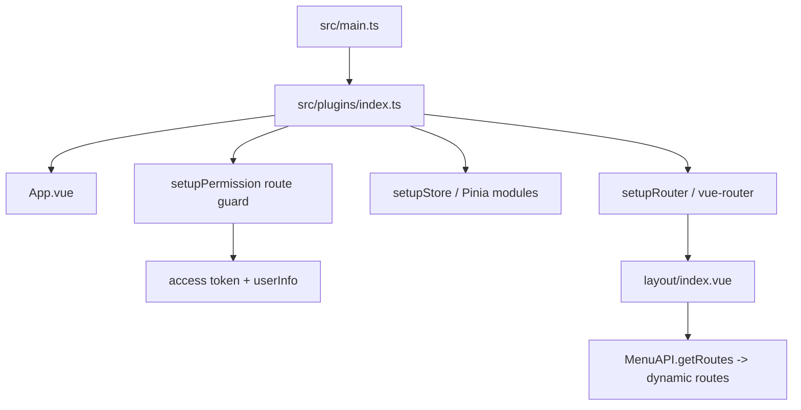

# 03：前端架构

| Concern | Current implementation | Source |
| --- | --- | --- |
| Framework | Vue 3 | `package.json`, `src/main.ts` |
| Version | `^3.5.13` | `package.json` |
| Build | Vite `^6.3.2` | `package.json`, `vite.config.ts` |
| Router | vue-router `^4.5.0`, hash history | `src/router/index.ts` |
| State | Pinia `^2.3.1` and Vuex `^4.1.0` declared; current auth/permission path uses Pinia | `src/store`, `src/store/modules` |
| HTTP | axios `^0.24.0`, centralized request/response interceptors | `src/utils/request.ts` |
| UI | Element Plus `^2.9.3` | `package.json`, `src/plugins` |
| Visualization | ECharts, Three.js, LogicFlow, WebSocket/STOMP/MQTT code paths | `package.json`, `src/views`, `src/modules` |

## 启动流程

## Route Inventory

静态/动态路由记录：**14**。动态菜单路由的实际 path/component 来自后端 MenuAPI.getRoutes() 返回值，源码无法在不运行系统或访问数据库的情况下列出具体运行时菜单。

| Path | Name | Component | Kind | Hidden | Source |
| --- | --- | --- | --- | --- | --- |
| /redirect |  | @/views/redirect/index.vue | STATIC | True | src/router/index.ts:9 |
| /redirect/:path(.*) |  | @/views/redirect/index.vue | STATIC | False | src/router/index.ts:14 |
| /login |  | @/views/login/index.vue | STATIC | True | src/router/index.ts:20 |
| /a/b |  | @/views/KanBan/JobMonitoring/index.vue | STATIC | False | src/router/index.ts:25 |
| /a/c |  | @/views/KanBan/Monitoring/index.vue | STATIC | False | src/router/index.ts:29 |
| / | Dashboard | @/views/dashboard/index.vue | STATIC | False | src/router/index.ts:37 |
| dashboard | Dashboard | @/views/dashboard/index.vue | STATIC | False | src/router/index.ts:43 |
| 404 |  | @/views/error/404.vue | STATIC | True | src/router/index.ts:56 |
| profile | Profile | @/views/profile/index.vue | STATIC | True | src/router/index.ts:61 |
| myNotice | MyNotice | @/views/system/notice/components/MyNotice.vue | STATIC | True | src/router/index.ts:67 |
| FlowEdit/:tmpCode | FlowEdit/:tmpCode | @/views/Task/TaskTemManage/components/FlowEdit.vue | STATIC | True | src/router/index.ts:73 |
| /drawing-tool | DrawingToolRoot |  | STATIC | False | src/router/index.ts:85 |
| index | DrawingTool | @/views/drawing-tool/index.vue | STATIC | False | src/router/index.ts:95 |
| BACKEND_MENU_DEFINED | dynamic menu routes | resolveViewComponent | DYNAMIC | False | src/plugins/permission.ts:18 |

## 页面/功能一级目录

| Module ID | Directory | File count | Confidence |
| --- | --- | ---: | --- |
| MOD-CODEGEN | src/views/codegen | 1 | CONFIRMED_FROM_CODE |
| MOD-DASHBOARD | src/views/dashboard | 6 | CONFIRMED_FROM_CODE |
| MOD-DEMO | src/views/demo | 22 | CONFIRMED_FROM_CODE |
| MOD-DRAWING-TOOL | src/views/drawing-tool | 1 | CONFIRMED_FROM_CODE |
| MOD-EMPLOYEE | src/views/Employee | 8 | CONFIRMED_FROM_CODE |
| MOD-ERROR | src/views/error | 2 | CONFIRMED_FROM_CODE |
| MOD-KANBAN | src/views/KanBan | 17 | CONFIRMED_FROM_CODE |
| MOD-LOGIN | src/views/login | 1 | CONFIRMED_FROM_CODE |
| MOD-LOGS | src/views/Logs | 5 | CONFIRMED_FROM_CODE |
| MOD-PROFILE | src/views/profile | 1 | CONFIRMED_FROM_CODE |
| MOD-REDIRECT | src/views/redirect | 1 | CONFIRMED_FROM_CODE |
| MOD-STATISTICS | src/views/Statistics | 2 | CONFIRMED_FROM_CODE |
| MOD-SYS | src/views/Sys | 8 | CONFIRMED_FROM_CODE |
| MOD-SYSTEM | src/views/system | 13 | CONFIRMED_FROM_CODE |
| MOD-TASK | src/views/Task | 24 | CONFIRMED_FROM_CODE |
