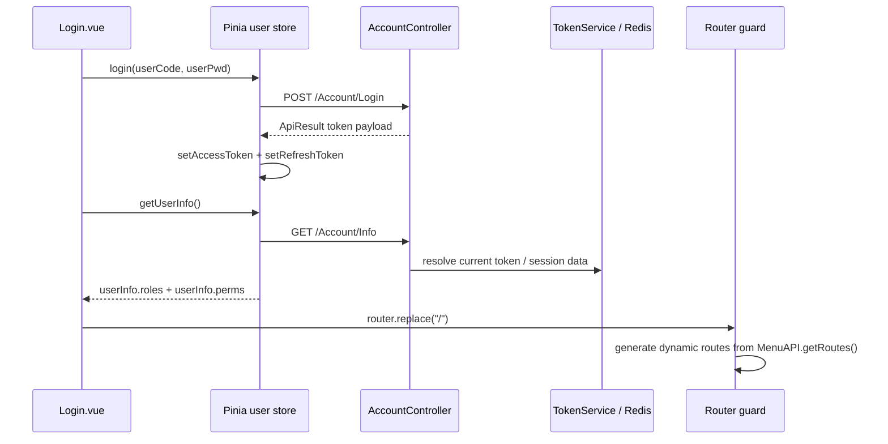

# 06：认证与权限设计

## Authentication

源码确认的令牌链：前端 `src/utils/auth.ts` 存取 `access_token`/`refresh_token`；请求拦截器把 access token 写入请求头 `token`；后端 `WebBaseController.OnBeforeHandler()` 读取该头并写入 `SessionInfo.token`，带 `[RequiresToken]` 的 Controller 再调用 `ITokenService.IsAuthenticated()`。

## Frontend permission

- `src/plugins/permission.ts` 白名单包含 `/login`、`/a/b`、`/a/c`；其它未登录路径重定向 `/login?redirect=...`。
- 登录后第一次路由进入会调用 `permissionStore.generateRoutes()`，再把后端菜单转换为 Vue Router 动态路由。组件路径无法解析时回退到 `views/error/404.vue`。
- `hasAuth()` 按 `roles`、`perms` 做按钮/角色判断；`ROOT` 角色对按钮权限直接返回 true。

## Backend permission

- 后端授权主要由 `[RequiresToken]` 与 `WebBaseController.OnBeforeHandler()` 组成；未标注该特性的 Controller 不会被该基类 token 检查拦截。
- Account 登录/刷新/注销端点与 Areas token 保护分开；`TokenService` 使用 Redis 用户信息判断 token 是否有效。
- 某些 Controller 未观察到 `RequiresToken`。这只能记录为 `POTENTIAL_SECURITY_DESIGN_GAP`/`UNKNOWN`，不能仅凭源码判定为 Bug，因为它们可能是外部或车载接口。

## Logout / refresh

`UserStore.logout()` 调用 `/Account/Logout` 后清理 token、动态路由和字典缓存；`refreshToken()` 调用 `/Account/refresh-token`，请求显式设置 `Authorization: no-auth`。具体 token 失效存储和部署 TTL 不能从前端源码单独确认。

既有 runtime 证据：`projects/test-workflow/reports/web-real-001-report.md` 记录了既有真实登录与 Dashboard Entry PASS；该报告不是本次重新执行结果，且没有把当前源码树证明为同一编译产物。
