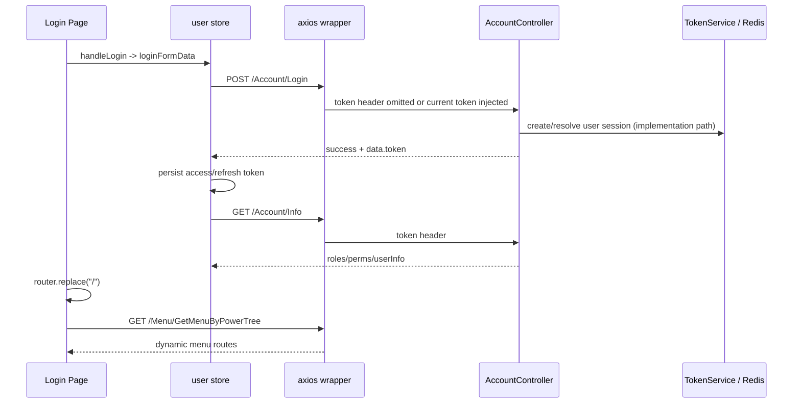
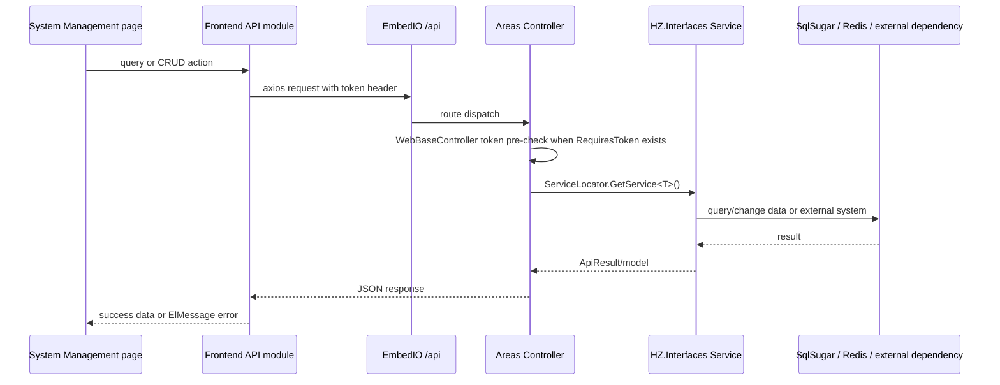

# 08：业务流程

## Login Flow

## System Management main flow

## Other cross-system flows

- Map/Task/Car modules contain CRUD and dispatch-related routes; exact business semantics are documented only as source names and endpoint families where no explicit domain specification exists.
- `RSStarter.UseWebSocket()` starts a periodic push loop for dashboard vehicle-position data; this is a source-confirmed runtime path, not visually tested in ARCH-001.
- `UseEmbedIO()` also registers `/` routes for traffic/vehicle-facing `WebAPIContainer` and `WebAPIAgvInterface`; these are not assumed to be browser page APIs.
