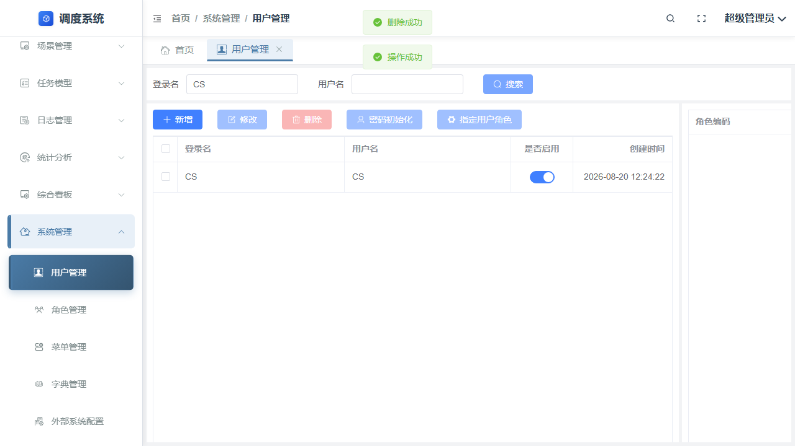
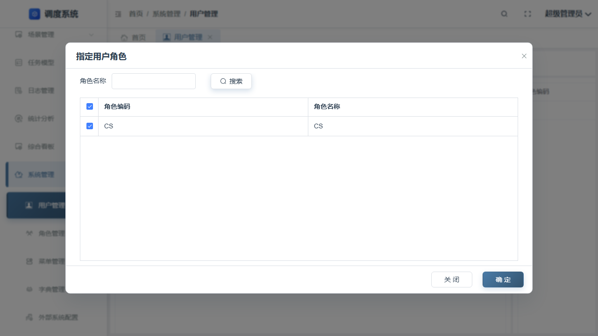
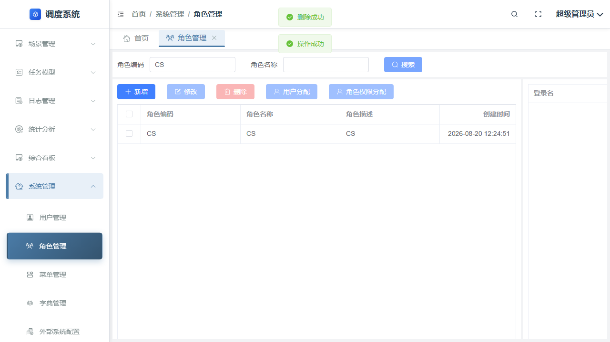
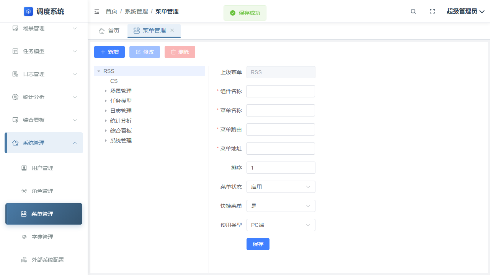
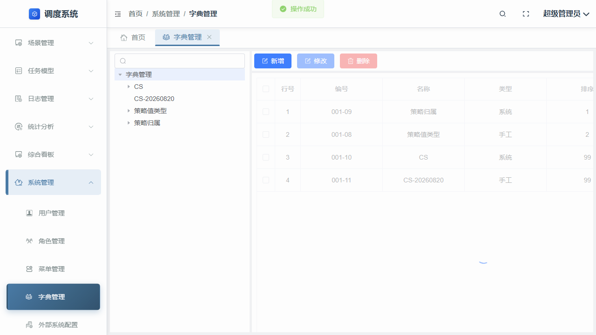
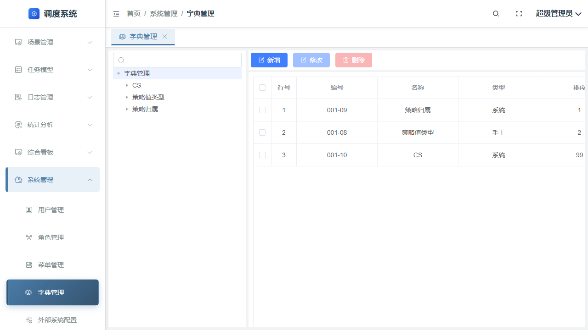
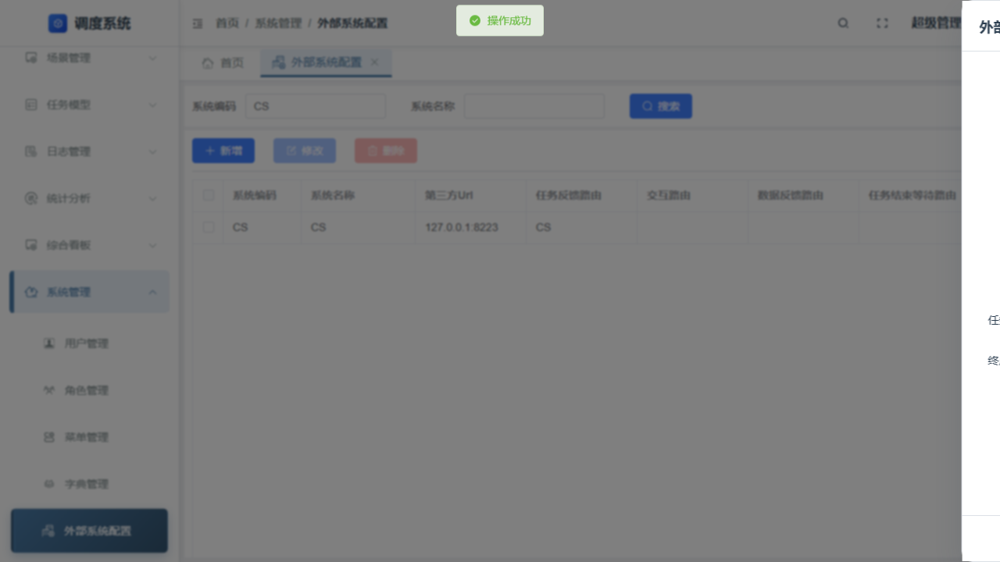

# Web 管理端系统管理功能测试用例报告

## 测试基本信息

| 项目 | 内容 |
|---|---|
| 测试依据 | `功能_02_Web管理端_系统管理(4).md` |
| 报告类型 | 完整测试用例报告 |
| 执行方式 | Playwright 真实页面操作；未执行项保留为 `SKIPPED` 或 `MANUAL` |
| 执行日期 | 2026-08-20 |
| 产品代码 | 未修改 |

## 测试用例结果

| 用例/流程 | TestCaseId | 状态 | 实际验证 | 图片示例 |
|---|---|---|---|---|
| 用户查询：空条件 | `TC-SM-USER-001` | PASS | 刷新查询可返回用户列表 |  |
| 用户查询：精确、模糊、无匹配 | `TC-SM-USER-006` | SKIPPED | 现有真实执行仅覆盖刷新查询；其余查询断言待补 |  |
| 用户查询：前后空格、特殊字符、非法字符、长度、分页、重置 | `TC-SM-USER-007` | SKIPPED | 未以真实业务约束执行输入边界和分页/重置组合 |  |
| 用户新增：必填、格式、边界 | `TC-SM-USER-002` | PASS | 隔离测试用户新增成功；正式套件已记录必填项校验 |  |
| 用户新增：重复属性、重复提交、保存失败 | `TC-SM-USER-008` | SKIPPED | 未执行重复用户名、重复提交和服务端保存失败注入 |  |
| 用户新增后查询、修改、删除 | `TC-SM-USER-003`、`TC-SM-USER-004` | PASS | 修改和删除完成；删除后刷新查询确认不存在 |  |
| 用户角色权限关联与状态恢复 | `TC-SM-USER-005` | PASS | 角色关联及最终关系复核通过 |  |
| 角色新增、必填/格式/边界、保存后查询 | `TC-SM-ROLE-001` | PASS | 隔离角色新增后可查询；正向保存验证通过 |  |
| 角色重复属性、重复提交、保存失败 | `TC-SM-ROLE-005` | SKIPPED | 未执行重复角色名、重复提交和失败注入 |  |
| 角色修改、权限配置、删除和恢复 | `TC-SM-ROLE-002`、`TC-SM-ROLE-003`、`TC-SM-ROLE-004` | PASS | 权限节点可复核；删除测试角色后已恢复 |  |
| 菜单查询：空/精确/模糊/无匹配/空格/特殊字符/非法字符/长度/分页/重置 | `TC-SM-MENU-006` | SKIPPED | 仅覆盖刷新查询；完整查询矩阵待补 |  |
| 菜单新增、修改、删除后查询 | `TC-SM-MENU-001`、`TC-SM-MENU-002`、`TC-SM-MENU-004`、`TC-SM-MENU-005` | PASS | 新增、修改、删除及删除后不存在复核通过 |  |
| 菜单必填/格式/边界/重复/重复提交/保存失败/权限 | `TC-SM-MENU-007` | SKIPPED | 异常输入、并发提交和最小权限矩阵未执行 |  |
| 字典新增、字典项新增修改、刷新查询 | `TC-SM-DICT-001`、`TC-SM-DICT-002`、`TC-SM-DICT-003` | PASS | 字典及字典项正向操作和刷新查询通过 |  |
| 字典查询完整矩阵与新增异常矩阵 | `TC-SM-DICT-006` | SKIPPED | 空、精确、模糊、无匹配、空格、特殊/非法字符、长度、分页、重置及保存异常待补 |  |
| 字典删除、系统字典保护和状态恢复 | `TC-SM-DICT-004`、`TC-SM-DICT-005` | PASS | 字典项删除通过；系统字典按产品规则拒绝删除 |  |
| 外部系统新增、修改、查询、删除 | `TC-SM-EXSYS-001`、`TC-SM-EXSYS-002`、`TC-SM-EXSYS-003`、`TC-SM-EXSYS-004` | PASS | 正向 CRUD 与查询通过 |  |
| 外部系统查询边界、必填/格式/重复/保存失败/权限 | `TC-SM-EXSYS-005` | SKIPPED | 完整查询、异常保存和权限矩阵待补 |  |

## 覆盖边界与数据处置

- 已执行的是现有正式 Web 套件的真实结果；`SKIPPED` 为设计覆盖项，不能视为通过。
- 创建的测试用户、菜单和外部系统配置均已清理；测试角色已恢复。未使用数据库写入、产品代码修改或绕过页面规则。
- 跨步骤的账号创建、授权、禁用、恢复和删除链路见[流程完整测试用例报告](流程_01_权限与登录_完整测试用例报告.md)。

## 测试结论

- 当前报告保留已真实执行结果和未执行覆盖项；`SKIPPED` 不等同于 `PASS`。
- 查询输入边界、重复新增、失败注入和最小权限场景仍需后续真实执行。

## 证据

- 原始 Playwright 截图、Trace、网络和页面错误证据位于 `../artifacts/`；本报告仅以 `图片证据/` 下的相对链接展示可复审示例。
- 首次 `TC-SM-DICT-004` 网络环境错误及重跑通过的事实，见[问题反馈报告](功能_02_Web管理端_系统管理_问题反馈报告.md)。
