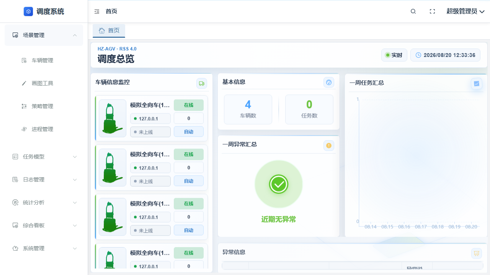
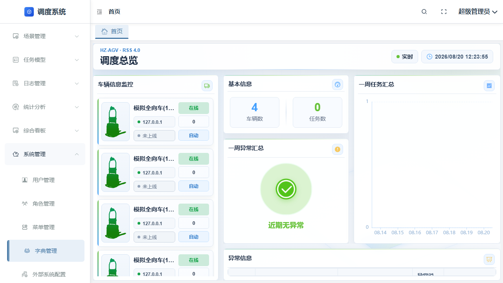
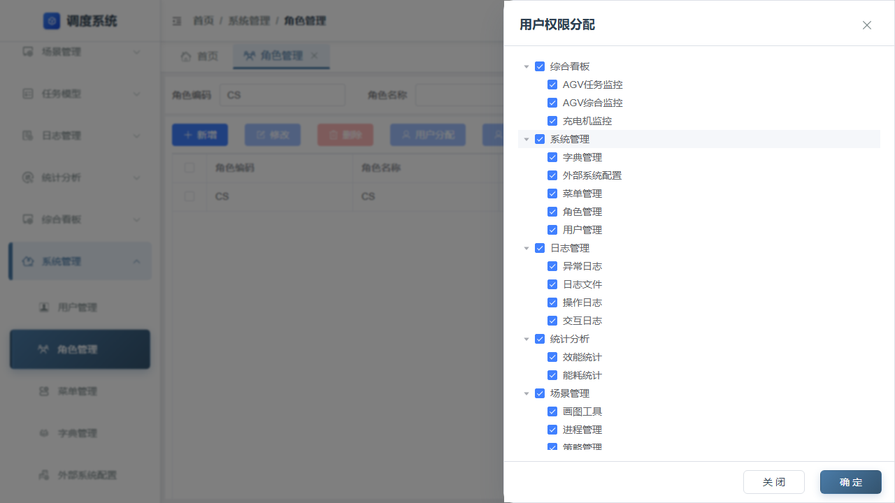
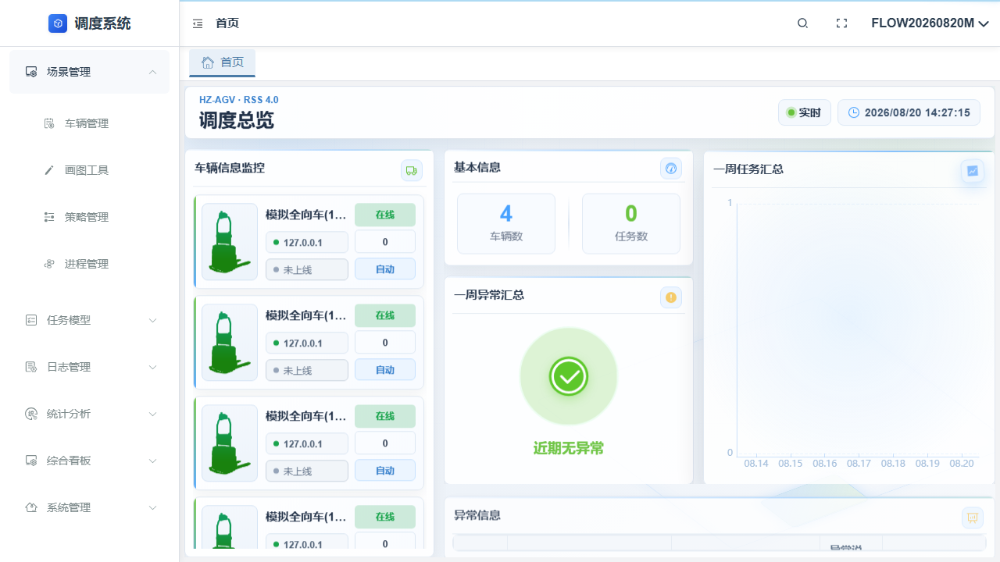
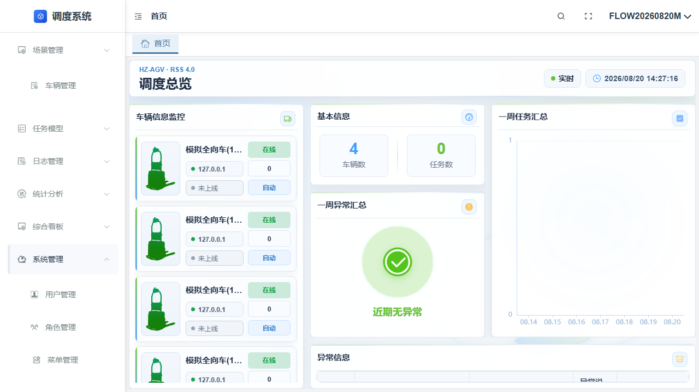
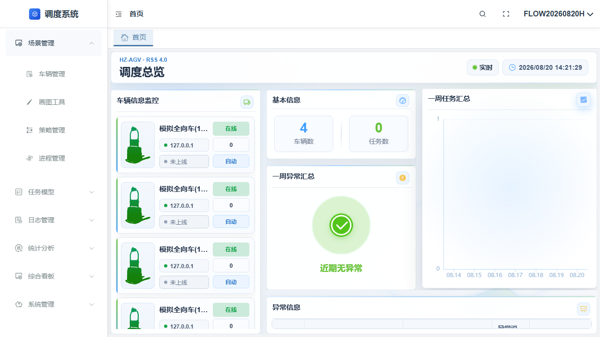
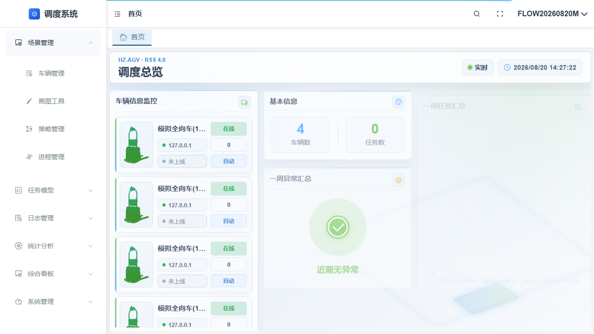
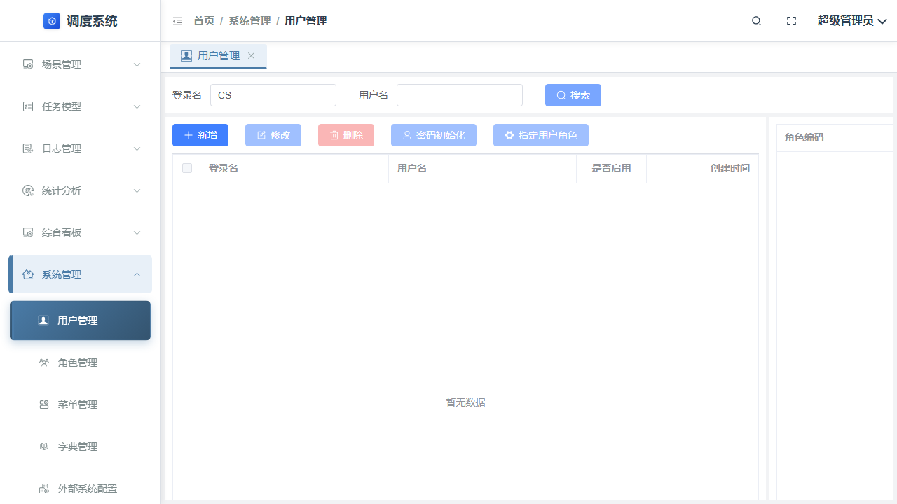

# 权限与登录流程测试文档

## 1. 测试基本信息

- 测试依据：`流程_01_权限与登录(3).md`
- 测试地址：`http://192.168.12.195:8223/`
- 管理员账号：`sa`（密码不写入文档）
- 执行日期：2026-08-20
- 执行方式：Playwright 真实页面操作

## 2. 已执行流程结果

| 流程/步骤 | TestCaseId | 结果 | 实际验证 | 图片示例 |
|---|---|---|---|---|
| 管理员登录 | `TC-WEB-LOGIN-001` | PASS | 登录页可见；登录请求成功；进入 Dashboard |  |
| 进入系统管理入口 | `TC-SM-ENV-001` | PASS | SA 登录后可进入系统管理菜单及页面 |  |
| 系统管理后的角色/权限关系复核 | `TC-SM-FINAL-001`、`TC-SM-FINAL-002` | PASS | 角色权限节点和用户角色关联可复核 |   |
| SA 创建普通账号、角色并关联 | `TC-FLOW-AUTH-001` | PASS | 通过真实页面创建隔离普通账号和角色，完成角色关联；普通账号可登录并进入 Dashboard |   |
| 禁用在线普通账号并验证会话 | `TC-FLOW-AUTH-002` | ERROR | 普通账号在线会话在管理员禁用后仍可见；恢复启用时页面开关未稳定切换，未据此宣称流程通过 |  |
| 启用状态普通账号重新登录 | `TC-FLOW-AUTH-003` | PASS | 独立执行中，启用状态的普通账号可以再次登录；不等同于 `TC-FLOW-AUTH-002` 的恢复启用 |  |
| 删除账号后拒绝登录 | `TC-FLOW-AUTH-004` | PASS | SA 删除普通账号，刷新查询确认不存在；删除账号再次登录被拒绝 |  |

## 3. 流程条目状态

以下状态按本次真实执行结果记录；`SKIPPED` 不等同于 PASS。

| 流程条目 | 状态 | 未执行原因 |
|---|---|---|
| `FL-AUTH-01` 新账号从零到可用 | PASS | 已完成普通账号、角色、角色关联和普通账号登录；本次角色授予了管理根节点，未验证最小权限集合 |
| `FL-AUTH-02` 权限变更对在线用户生效时机 | SKIPPED | 需要两个独立浏览器会话及刷新前后对照 |
| `FL-AUTH-03` 账号禁用/删除对会话与登录的影响 | ERROR | 已执行双会话；禁用后的在线会话仍可见、删除后登录被拒绝，但禁用后恢复启用的页面操作未稳定完成 |
| `FL-AUTH-04` 登录态失效与异常分支 | SKIPPED | 需要独立接口/token 测试面，不属于当前 Web 页面套件 |
| `FL-AUTH-05` 多端并存与并发 | SKIPPED | 需要双浏览器/并发保存场景 |
| `FL-AUTH-06` `sa` 与普通账号权限对照 | SKIPPED | 需要普通账号菜单集合对照，当前套件仅使用 SA 执行管理操作 |
| `FL-AUTH-07` 授权文件异常时的登录拒止 | SKIPPED | 需要操作产品运行主机上的授权文件和系统时间，当前测试范围未触碰产品运行环境 |

## 4. 流程测试结论

本次通过 SA 创建并清理了隔离普通账号和角色，`TC-FLOW-AUTH-001`、`TC-FLOW-AUTH-003`、`TC-FLOW-AUTH-004` 通过。`TC-FLOW-AUTH-002` 在禁用后的在线会话观察阶段取得证据，但恢复启用操作未完成，按 `ERROR` 记录；不能据此宣称 `FL-AUTH-01` 至 `FL-AUTH-07` 全部通过。

未覆盖项仍包括最小权限对照、权限变更时机、登录态/token、并发以及授权文件异常。所有本次创建的 `FLOW20260820*` 临时账号均已通过 SA 用户管理页面查询确认不存在；产品代码未修改，密码未写入文档。

## 5. 测试实现与证据

- TestCase 记录：`test-cases/web/TC-FLOW-AUTH-001.md`
- 自动化实现：`tests/web/real-project/TC_SM_USER_FLOW_001.spec.ts`
- Playwright 截图、Trace、网络和页面错误证据：`projects/test-workflow/artifacts/test-results/`
- `TC-FLOW-AUTH-002` 的启停恢复异常保留为 `ERROR` 证据，未改写为 PASS。
